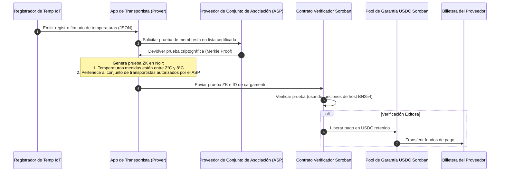
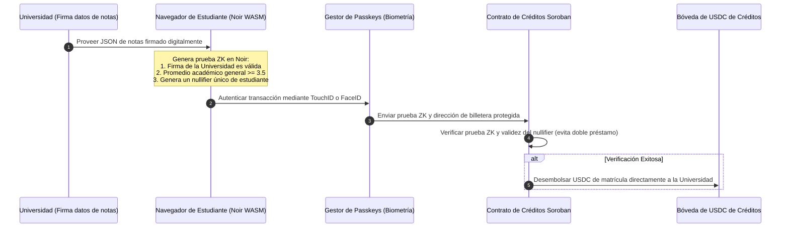
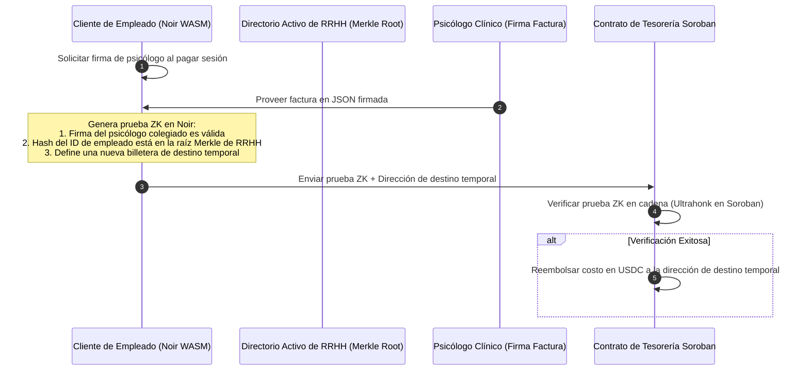

# Lluvia de ideas (Brainstorming): Stellar Hacks - ZK en el Mundo Real
*Desarrollado por Gemini 3.5 Flash*

Este documento presenta un análisis profundo de la hackathon **Stellar Hacks: Real-World ZK**, enfocándose en cómo combinar tu formación y experiencia en **EdTech, FoodTech, BioTech y Blockchain** con las ventajas arquitectónicas únicas de Stellar y la criptografía moderna de conocimiento cero (ZK).

---

## 1. La ventaja de Stellar + ZK: Inmersión Técnica Profunda

Para ganar la hackathon, debemos construir un proyecto que aproveche las fortalezas principales de Stellar, las cuales lo diferencian claramente de otras cadenas Layer 1 y Layer 2:

### A. Optimización del Host en los Protocolos 25 y 26
*   **Protocolo 25 ("X-Ray"):** Introdujo funciones nativas del host para operaciones en la curva elíptica BN254 y hashing Poseidon.
*   **Protocolo 26 ("Yardstick"):** Introdujo nueve funciones de host BN254 adicionales (multiplicación multiescalar - MSM, aritmética de campos escalares y comprobación de membresía en curvas).
*   **La Ventaja:** Esto traslada la verificación de pruebas criptográficas complejas fuera de la máquina virtual WASM (Soroban) directamente a la ejecución nativa en el host. Los contratos verificadores de Noir (UltraHonk) y Circom/RISC Zero (Groth16) ahora son sumamente económicos, rápidos y estables en Stellar, evitando los límites tradicionales de gas y cómputo de la VM.

### B. Privacidad con Cumplimiento Normativo (ASPs y Pools de Privacidad)
*   **El Desafío:** Los sistemas tradicionales de privacidad (como Tornado Cash) ocultan todo, convirtiéndose en pesadillas regulatorias.
*   **El Enfoque de Stellar:** La red promueve la "privacidad con cumplimiento". Utilizando **Proveedores de Conjuntos de Asociación (ASPs)** y listas de inclusión/exclusión (como se describe en el whitepaper de *Privacy Pools*), un usuario puede demostrar que pertenece a un grupo de transacciones limpio y regulado sin revelar su dirección específica.
*   **La Ventaja:** Construir un proyecto que integre comprobaciones de ASP dentro de la verificación ZK demuestra un alto nivel de preparación para el cumplimiento del mundo real, que es uno de los criterios clave de evaluación de la Stellar Development Foundation (SDF).

### C. Abstracción de Cuentas Nativa y Llaves de Acceso (Passkeys - Secp256r1)
*   **El Desafío:** Las aplicaciones ZK suelen tener una experiencia de usuario (UX) deficiente debido a la gestión de frases semilla y la firma manual de pruebas.
*   **El Enfoque de Stellar:** Stellar tiene soporte nativo para contratos de cuenta personalizados y **verificación de firmas Secp256r1 (Passkeys)**.
*   **La Ventaja:** Los usuarios pueden firmar transacciones o autorizar envíos de pruebas ZK mediante autenticación biométrica (TouchID/FaceID) en su navegador, eliminando la necesidad de gestionar claves privadas complejas.

### D. Rieles de Liquidez Profunda (USDC y EURC)
*   **La Ventaja:** Stellar está diseñada para mover dinero real en el mundo real. Los proyectos que activan liberaciones automáticas de depósitos en garantía (escrow), desembolsos o micropréstamos en **USDC** o **EURC** nativos tienen viabilidad comercial inmediata.

---

## 2. Frameworks de ZK en Stellar: Análisis de Compensaciones (Trade-offs)

Para una hackathon de 10 días (fecha límite de entrega: 29 de junio), seleccionar la herramienta ZK correcta es fundamental:

| Herramienta ZK | Lenguaje Principal | Verificador en Stellar | Tipo de Prueba | Ventajas | Desventajas | Mejor Caso de Uso |
| :--- | :--- | :--- | :--- | :--- | :--- | :--- |
| **Noir** | DSL similar a Rust | `rs-soroban-ultrahonk` | UltraHonk | Muy fácil de escribir; sintaxis amigable para desarrolladores de Rust; optimizado para el Protocolo 26. | Tamaño de prueba ligeramente mayor. | Identidad, credenciales, membresía, pruebas de rango. |
| **RISC Zero** | Rust Estándar | `stellar-risc0-verifier` | Groth16 | Permite escribir código en Rust estándar; perfecto para procesar archivos complejos (JSON, CSV). | Tiempo de generación de pruebas elevado fuera de cadena; requiere configuración de host. | Procesamiento de datos pesados (genómica, registros de IoT, algoritmos complejos). |
| **Circom** | DSL de Restricciones | `groth16_verifier` | Groth16 | Genera pruebas sumamente pequeñas y baratas de verificar en cadena. | Curva de aprendizaje empinada; escritura basada en restricciones matemáticas. | Pools de privacidad, transacciones blindadas simples. |

---

## 3. 15 Ideas de ZK en Stellar para el Mundo Real

### 🧬 BioTech y Cuidado de la Salud

#### Idea 1: ZK-ClinicalTrial (Eficacia Verificable de Ensayos Clínicos)
*   **Concepto:** Las farmacéuticas demuestran que los grupos de ensayos clínicos cumplieron los objetivos de seguridad y eficacia para liberar fondos de patrocinadores, sin divulgar historiales médicos de pacientes ni fórmulas químicas propietarias.
*   **Componente ZK:** Un programa en RISC Zero procesa la base de datos médica (firmada digitalmente por un laboratorio certificado) y demuestra que se cumplieron los umbrales de seguridad.
*   **Integración con Stellar:** Un contrato de garantía (escrow) en Soroban verifica la prueba y libera automáticamente el financiamiento por hitos en USDC.

#### Idea 2: ZK-DNA-Privacy (Suscripción Anónima para Seguros de Salud)
*   **Concepto:** Demostrar la ausencia de mutaciones genéticas de alto riesgo específicas (como BRCA1) para calificar para descuentos en primas de seguros, sin exponer tu archivo de ADN genómico completo al asegurador.
*   **Componente ZK:** Un programa en RISC Zero analiza el archivo genómico crudo (ej. formato 23andMe) y verifica la ausencia de las mutaciones objetivo.
*   **Integración con Stellar:** Se integra con un contrato de pool de seguros de Soroban utilizando autenticación por Passkey para proteger la cuenta del usuario.

#### Idea 3: ZK-PatientPools (Crowdfunding Regulado de Enfermedades Raras)
*   **Concepto:** Pacientes con enfermedades raras realizan campañas de financiamiento colectivo. Demuestran la autenticidad de su diagnóstico médico sin revelar sus identidades reales para evitar la discriminación.
*   **Componente ZK:** Un circuito en Noir verifica la firma criptográfica del hospital sobre un código médico ICD-10, emitiendo una prueba de validez.
*   **Integración con Stellar:** Las donaciones de USDC bloqueadas en garantía se liberan a la dirección de Stellar del hospital, utilizando listas de control de ASPs para asegurar el cumplimiento legal.

#### Idea 4: ZK-CleanAthlete (Registro Atlético Limpio y Antidopaje)
*   **Concepto:** Los atletas demuestran haber dado negativo en sustancias prohibidas en paneles recientes sin filtrar marcadores bioquímicos ni perfiles de salud sensibles que puedan ser utilizados para espionaje deportivo.
*   **Componente ZK:** Un circuito en Noir verifica la firma del laboratorio en el panel de pruebas y valida que las proporciones hormonales estén bajo los límites de la WADA.
*   **Integración con Stellar:** Los patrocinadores consultan este registro en Stellar para autorizar automáticamente los pagos mensuales configurados en contratos de depósito.

---

### 🌾 FoodTech y Agricultura

#### Idea 5: ZK-Organic-Escrow (Logística Verde Verificable y Pago de Fletes)
*   **Concepto:** Demostrar que los cargamentos de alimentos se mantuvieron dentro de los rangos de temperatura de cadena de frío requeridos (ej. 2°C a 8°C) y que provienen de origen orgánico, sin exponer rutas comerciales, ubicaciones GPS exactas de granjas ni nombres de proveedores.
*   **Componente ZK:** Un circuito en Noir verifica el registro firmado del sensor IoT de temperatura, demostrando que ninguna medición excedió los límites.
*   **Integración con Stellar:** Al verificarse la prueba, Soroban libera de forma automática el pago en USDC retenido al transportista.

#### Idea 6: ZK-FairPrice (Auditoría Verificable de Precios Justos al Productor)
*   **Concepto:** Las marcas de café demuestran que pagan precios de comercio justo a cooperativas de agricultores locales, sin exponer los números ni contratos comerciales privados al público.
*   **Componente ZK:** Un circuito en Noir procesa las facturas firmadas por las cooperativas, demostrando que el precio promedio ponderado pagado supera el umbral mínimo internacional.
*   **Integración con Stellar:** El contrato registra el cumplimiento en Stellar, actualizando una puntuación de transparencia ESG pública para la marca.

#### Idea 7: ZK-Soil-Carbon (Monetización de Créditos de Carbono Agrícola)
*   **Concepto:** Los agricultores demuestran el secuestro de carbono mediante agricultura regenerativa para emitir créditos, manteniendo en privado los límites exactos de sus tierras y la composición química del suelo.
*   **Componente ZK:** Un programa en RISC Zero procesa datos de laboratorios de suelo e imágenes satelitales, certificando que los niveles de carbono aumentaron en X toneladas.
*   **Integración con Stellar:** La verificación exitosa emite directamente tokens de créditos de carbono en la billetera de Stellar del agricultor.

#### Idea 8: ZK-FoodWaste-Tax (Auditorías de Donación de Excedentes de Alimentos)
*   **Concepto:** Supermercados demuestran que donaron al menos el 15% de su excedente diario de alimentos a organizaciones benéficas para reclamar deducciones fiscales, sin exponer volúmenes de ventas ni cifras de inventario crudas.
*   **Componente ZK:** Un circuito en Noir verifica que la proporción entre los recibos de donación y los registros de merma es $\ge 15\%$.
*   **Integración con Stellar:** El contrato inteligente de Soroban emite una insignia digital de cumplimiento ESG no transferible vinculada al perfil corporativo del comercio.

---

### 🎓 EdTech y Capital Humano

#### Idea 9: ZK-Credential (Verificación de Títulos y Expedientes Académicos)
*   **Concepto:** Los candidatos a un empleo demuestran sus credenciales (ej. graduado de Ingeniería en Computación con promedio $\ge 3.5$) sin revelar su nombre, año de graduación ni materias reprobadas en su historial.
*   **Componente ZK:** Un circuito en Noir verifica la firma de la universidad sobre el archivo JSON del expediente y valida la condición del promedio de notas.
*   **Integración con Stellar:** Facilita el proceso de postulación a pools de becas o tareas de programación técnica utilizando Stellar Passkeys para el registro ágil.

#### Idea 10: ZK-UndergradCredit (Micropréstamos Estudiantiles basados en Mérito)
*   **Concepto:** Estudiantes de países en desarrollo utilizan su rendimiento académico como un sustituto de historial crediticio para préstamos de matrícula, sin exponer registros personales sensibles.
*   **Componente ZK:** Un circuito en Noir procesa las calificaciones firmadas y calcula una puntuación de rendimiento académico verificable.
*   **Integración con Stellar:** Un pool de préstamos de Soroban verifica la prueba y transfiere los fondos del crédito en USDC directamente al contrato de la universidad.

#### Idea 11: ZK-StudyGroup (Garantías de Progreso en Grupos de Estudio)
*   **Concepto:** Estudiantes crean grupos de estudio e integran depósitos. Recuperan su dinero e intereses acumulados solo si demuestran haber aprobado los exámenes del curso, sin exponer sus calificaciones individuales a sus compañeros para evitar competencia tóxica.
*   **Componente ZK:** Un circuito en Noir procesa el certificado de aprobación digital (ej. Coursera o edX) y verifica que el estado es "APROBADO".
*   **Integración con Stellar:** Un contrato de garantía de Soroban automatiza la redistribución justa de los fondos depositados.

#### Idea 12: ZK-SkillMatch (Portal de Reclutamiento Técnico Libre de Sesgos)
*   **Concepto:** Programadores demuestran sus habilidades (ej. haber resuelto más de 200 ejercicios difíciles en LeetCode) sin revelar su edad, nacionalidad ni género.
*   **Componente ZK:** Un circuito en Noir procesa los perfiles firmados de la plataforma de evaluación y valida el ranking del postulante.
*   **Integración con Stellar:** Permite a los programadores reclamar al instante tareas técnicas y recibir recompensas en stablecoins una vez completadas las condiciones del contrato.

---

### 🌐 Transversal y Privacidad en el Mundo Real

#### Idea 13: ZK-Therapy-Reimburse (Reembolso Anónimo de Beneficios de Salud Mental)
*   **Concepto:** Las empresas subsidian terapias psicológicas para sus empleados, garantizando que el departamento de recursos humanos no pueda rastrear qué empleado accedió a terapia ni qué psicólogo lo atendió.
*   **Componente ZK:** Un circuito en Noir valida un recibo emitido y firmado por un terapeuta certificado, confirmando la validez de la consulta y emitiendo una dirección de billetera de destino de un solo uso.
*   **Integración con Stellar:** El contrato de tesorería corporativa en Stellar verifica la prueba y deposita la ayuda en USDC a la dirección de destino no vinculada.

#### Idea 14: ZK-UrbanGarden (Descuentos de Impuestos Verdes sin Pérdida de Privacidad)
*   **Concepto:** Los municipios otorgan descuentos de impuestos a propiedades con al menos 20% de áreas verdes. Los propietarios demuestran el cumplimiento sin publicar imágenes aéreas de alta resolución que expongan su patio trasero.
*   **Componente ZK:** Un programa en RISC Zero procesa la imagen satelital catastral y calcula que la cobertura verde supera el 20%, publicando solo un resultado binario.
*   **Integración con Stellar:** Registra vales de crédito fiscal directamente en los registros catastrales tokenizados en la red Stellar.

#### Idea 15: ZK-EcoSeed (Pureza de Semillas Libres de GMO para Agricultura Organica)
*   **Concepto:** Los agricultores adquieren lotes de semillas con certificación de pureza orgánica libre de GMO, sin que los proveedores de semillas deban publicar las secuencias genómicas patentadas de sus variedades cruzadas.
*   **Componente ZK:** Un programa en RISC Zero analiza la secuencia de ADN del lote y demuestra que la concordancia con genes modificados es nula y la pureza es superior al 99.9%.
*   **Integración con Stellar:** Ejecuta de forma automática el contrato inteligente de compraventa en Stellar una vez validado el lote de semillas.

---

## 4. Matriz de Viabilidad y Abstracción

Esta matriz evalúa cada idea según su **Viabilidad Técnica**, **Velocidad de Implementación (10 Días)**, **Atractivo para la Hackathon (WOW factor)** y **Utilidad en el Mundo Real** dentro de Stellar.

*Calificación: Bajo (1) a Alto (5)*

| # | Nombre del Proyecto | Viabilidad Técnica | Velocidad (10 Días) | Atractivo Hackathon | Utilidad Real | Puntaje Total | Framework Recomendado |
| :--- | :--- | :---: | :---: | :---: | :---: | :---: | :--- |
| **1** | **ZK-ClinicalTrial** | 4 | 3 | 5 | 5 | **17** | RISC Zero |
| **2** | **ZK-DNA-Privacy** | 3 | 2 | 5 | 4 | **14** | RISC Zero |
| **3** | **ZK-PatientPools** | 4 | 4 | 4 | 5 | **17** | Noir (con soporte de ASPs) |
| **4** | **ZK-CleanAthlete** | 4 | 4 | 3 | 3 | **14** | Noir |
| **5** | **ZK-Organic-Escrow** | 5 | 4 | 5 | 5 | **19** | Noir + Soroban Token Interface |
| **6** | **ZK-FairPrice** | 5 | 4 | 4 | 5 | **18** | Noir |
| **7** | **ZK-Soil-Carbon** | 3 | 2 | 5 | 5 | **15** | RISC Zero |
| **8** | **ZK-FoodWaste-Tax** | 5 | 4 | 4 | 4 | **17** | Noir |
| **9** | **ZK-Credential** | 5 | 5 | 4 | 5 | **19** | Noir + Smart Wallet (Passkeys) |
| **10**| **ZK-UndergradCredit** | 4 | 4 | 4 | 5 | **17** | Noir |
| **11**| **ZK-StudyGroup** | 5 | 5 | 3 | 4 | **17** | Noir |
| **12**| **ZK-SkillMatch** | 4 | 4 | 4 | 4 | **16** | Noir |
| **13**| **ZK-Therapy-Reimburse** | 4 | 4 | 5 | 5 | **18** | Noir + Salida de clave dinámica |
| **14**| **ZK-UrbanGarden** | 3 | 2 | 4 | 3 | **12** | RISC Zero |
| **15**| **ZK-EcoSeed** | 3 | 2 | 4 | 4 | **13** | RISC Zero |

---

## 5. Arquitecturas de las 3 Ideas Finalistas (Detalle Técnico)

### 🏆 Opción A: **ZK-Organic-Escrow** (Logística de Cadena de Frío y Liberación en USDC)
*   **Por qué gana:** Conecta sensores IoT reales, finanzas descentralizadas y cumplimiento de privacidad. Mediante **Proveedores de Conjuntos de Asociación (ASPs)**, la empresa transportista demuestra estar en la lista de operadores certificados sin revelar sus rutas específicas ni clientes, satisfaciendo el enfoque de cumplimiento de Stellar.
*   **Diagrama de Secuencia:**

---

### 🏆 Opción B: **ZK-Credential / ZK-UndergradCredit** (Crédito Estudiantil Seguro con Passkeys)
*   **Por qué gana:** Resuelve la inclusión financiera universitaria y la privacidad de datos. Usando **Stellar Passkeys**, el estudiante crea una billetera inteligente biométrica en Soroban y solicita financiamiento demostrando sus notas sobresalientes sin exponer su identidad ni sus calificaciones detalladas.
*   **Diagrama de Secuencia:**

---

### 🏆 Opción C: **ZK-Therapy-Reimburse** (Beneficios de Salud Mental Corporativos Confidenciales)
*   **Por qué gana:** Utilidad corporativa excepcional en la vida real. Emplea la criptografía ZK para ocultar las identidades de los empleados mientras verifica que pertenezcan a la lista de nómina activa de la empresa. Utiliza enrutamiento dinámico para enviar los USDC a billeteras temporales no vinculadas, anulando rastreos.
*   **Diagrama de Secuencia:**

---

## 6. Plan de Ejecución de 10 Días (Paso a Paso)

Si seleccionas **ZK-Organic-Escrow** (u otra idea similar), sigue este flujo diario estructurado para asegurar tu entrega:

### Fase 1: Circuitos Criptográficos (Días 1 a 3)
*   **Día 1:** Inicializa tu proyecto Soroban usando `Scaffold Stellar`. Configura el entorno de Noir (`nargo`).
*   **Día 2:** Escribe el circuito Noir (`main.nr`). Define las entradas privadas (registros de temperatura de sensores, camino Merkle de membresía del ASP) y públicas (limites de temperatura, raíz Merkle activa del ASP, clave pública del emisor del sensor). Genera pruebas de prueba locales.
*   **Día 3:** Compila el circuito a WebAssembly (WASM). Prueba la generación de pruebas en el navegador cliente usando las librerías oficiales de Javascript de Aztec (`@noir-lang/noir_js`).

### Fase 2: Contratos Inteligentes en Soroban (Días 4 a 6)
*   **Día 4:** Escribe el contrato verificador en Soroban importando el template `rs-soroban-ultrahonk` u optimizando el verificador de Groth16.
*   **Día 5:** Construye la lógica del contrato de fideicomiso/garantía. Conéctalo a la interfaz de tokens de Soroban para gestionar saldos de USDC/EURC. Vincula la verificación de la prueba ZK como requisito indispensable antes de la dispersión de fondos.
*   **Día 6:** Escribe y ejecuta pruebas unitarias exhaustivas en Rust para Soroban, simulando tanto pruebas ZK válidas como intentos de fraude con pruebas inválidas.

### Fase 3: Integración de Frontend y Experiencia de Usuario (Días 7 a 9)
*   **Día 7:** Diseña una interfaz web clara e intuitiva en React + Vanilla CSS con diseño moderno, enfocada en flujos directos (como cargar un archivo JSON con los logs del sensor).
*   **Día 8:** Integra la librería `Stellar Wallets Kit` para permitir la conexión de billeteras y configura la firma biométrica mediante **Passkeys**.
*   **Día 9:** Ejecuta pruebas de extremo a extremo en la Testnet de Stellar. Graba el video demostrativo de 2-3 minutos mostrando la generación de la prueba del lado del cliente y la verificación con liberación inmediata del dinero en la Testnet.

### Fase 4: Preparación y Entrega (Día 10)
*   **Día 10:** Limpia el código de tu repositorio en GitHub, redacta un archivo `README.md` explicativo y profesional detallando el rol crucial y activo de ZK en la lógica, y sube tu postulación a DoraHacks.
