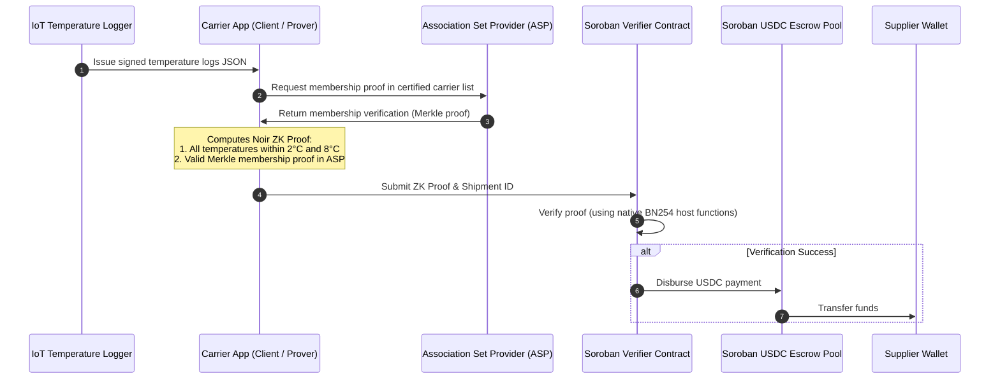
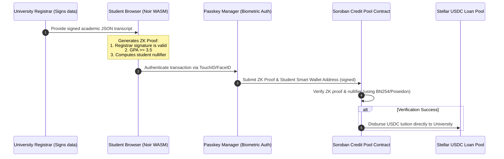
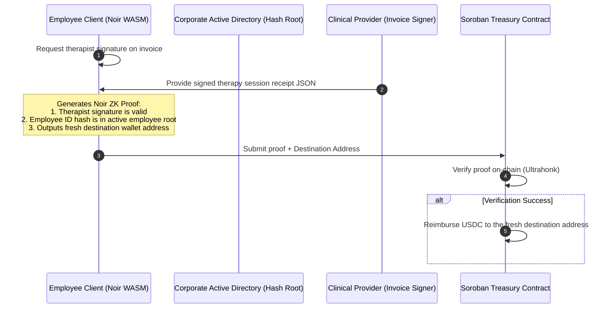

# Brainstorming: Stellar Hacks - Real-World ZK
*Powered by Gemini 3.5 Flash*

This document outlines a deep-dive analysis of the **Stellar Hacks: Real-World ZK** hackathon, focusing on how to combine your background in **EdTech, FoodTech, BioTech, and Blockchain** with the unique architectural advantages of Stellar and modern Zero-Knowledge (ZK) cryptography.

---

## 1. The Stellar + ZK Advantage: Technology Deep Dive

To win the hackathon, we must build a project that leverages Stellar's core strengths, which are distinct from other Layer 1/2 chains:

### A. Protocol 25 & 26 Host Optimization
*   **Protocol 25 ("X-Ray"):** Introduced native host functions for BN254 elliptic-curve operations and Poseidon hashing.
*   **Protocol 26 ("Yardstick"):** Introduced nine additional BN254 host functions (Multi-Scalar Multiplication, scalar-field arithmetic, and curve-membership checks).
*   **The Advantage:** This moves heavy cryptographic proof verification out of the WASM virtual machine (Soroban) directly into native host execution. Noir (UltraHonk) and Circom/RISC Zero (Groth16) verifier contracts are now incredibly cheap, fast, and stable, bypassing traditional gas limit barriers.

### B. Compliant Privacy (ASPs & Privacy Pools)
*   **The Challenge:** Traditional privacy systems (like Tornado Cash) hide everything, making them compliance nightmares.
*   **The Stellar Approach:** The network champions "compliant privacy." By using **Association Set Providers (ASPs)** and allow/deny lists (as described in the *Privacy Pools* whitepaper), a user can prove they are part of a clean, compliant transaction group without revealing their exact address.
*   **The Advantage:** Building a project that integrates ASP checks inside the ZK verification shows a high level of real-world compliance readiness, which is a major judging criteria for the Stellar Development Foundation (SDF).

### C. Native Account Abstraction & Passkeys (Secp256r1)
*   **The Challenge:** ZK applications usually have a terrible user experience (UX) because of seed phrase management and proof signing.
*   **The Stellar Approach:** Stellar has native support for custom account contracts and **Secp256r1 signature verification (Passkeys)**.
*   **The Advantage:** Users can sign transactions or authorize ZK proof submissions using biometric authentication (TouchID/FaceID) in their browser.

### D. Deep Liquidity Rails (USDC & EURC)
*   **The Advantage:** Stellar is designed to move real money. Projects that trigger automated escrow releases, payouts, or microloans in native **USDC** or **EURC** have immediate commercial viability.

---

## 2. ZK Frameworks on Stellar: Trade-Off Analysis

For a 10-day hackathon (deadline June 29), selecting the correct ZK tool is critical:

| ZK Tool | Core Language | Stellar Verifier | Proof Type | Pros | Cons | Best Fit |
| :--- | :--- | :--- | :--- | :--- | :--- | :--- |
| **Noir** | Rust-like DSL | `rs-soroban-ultrahonk` | UltraHonk | Easiest to write; native Rust developer feel; optimized for Protocol 26. | Slightly larger proof size. | Identity, credentials, membership, range proofs. |
| **RISC Zero** | Standard Rust | `stellar-risc0-verifier` | Groth16 | Write ordinary Rust; perfect for processing raw files (JSON, CSV). | High proof-generation time; requires host setup. | Heavy data processing (genomics, IoT logs, algorithms). |
| **Circom** | Custom DSL | `groth16_verifier` | Groth16 | Produces tiny proofs; highly gas-optimized. | Very steep learning curve; mathematical constraint writing. | Shielded payments, privacy pools. |

---

## 3. 15 Real-World Stellar ZK Ideas (Optimized for Stellar's Edge)

### 🧬 BioTech & Healthcare

#### Idea 1: ZK-ClinicalTrial (Verifiable Efficacy for Trial Milestones)
*   **Concept:** Pharmaceutical companies prove clinical trial cohorts met safety and efficacy targets to trigger funding, without disclosing patient records or drug chemical formulations.
*   **ZK Component:** A RISC Zero program processes the medical database (signed by a lab) and proves safety thresholds were met.
*   **Stellar Edge:** A Soroban escrow contract verifies the proof and releases milestone funding in USDC.

#### Idea 2: ZK-DNA-Privacy (Anonymous Underwriting for Health Insurance)
*   **Concept:** Prove you lack specific high-risk genetic mutations (e.g., BRCA1) to qualify for insurance premium discounts, without exposing your raw genomic data file.
*   **ZK Component:** A RISC Zero program parses a raw genomic file (like 23andMe) and verifies the absence of target gene mutations.
*   **Stellar Edge:** Integrates with a Soroban insurance pool contract using Passkey auth to secure the user's account.

#### Idea 3: ZK-PatientPools (Compliant Rare Disease Crowdfunding)
*   **Concept:** Rare disease patients crowdfund treatments. They prove their medical diagnosis is genuine without revealing their identities.
*   **ZK Component:** Noir circuit verifies a hospital's cryptographic signature on an ICD-10 medical code, outputting a verification proof.
*   **Stellar Edge:** Escrowed USDC donations are released to the hospital's Stellar address, using ASP allowlists to ensure compliance.

#### Idea 4: ZK-CleanAthlete (Clean Athletic Registry)
*   **Concept:** Athletes prove they tested clean for banned substances in recent anti-doping panels without leaking biochemical markers or health details.
*   **ZK Component:** Noir circuit verifies a lab's signature on a testing panel, checking that all hormone/drug ratios are below WADA thresholds.
*   **Stellar Edge:** Sponsors query this clean registry on Stellar to automatically authorize monthly promotional payouts.

---

### 🌾 FoodTech & Agriculture

#### Idea 5: ZK-Organic-Escrow (Verifiable Green Logistics & Payment Release)
*   **Concept:** Prove food shipments remained in cold-chain temperature thresholds (e.g., 2°C to 8°C) and are organic, without exposing logistics routes or supplier names.
*   **ZK Component:** Noir circuit verifies a signed sensor log, proving that no temperature measurement exceeded thresholds.
*   **Stellar Edge:** Automatically releases USDC cargo payment to the carrier on Stellar.

#### Idea 6: ZK-FairPrice (Verifiable Farmer Revenue Auditing)
*   **Concept:** Brands prove they pay fair-trade coffee prices to local farmers without exposing private commercial contract numbers.
*   **ZK Component:** Noir circuit processes invoices signed by cooperatives, proving that the weighted average price paid per pound exceeds the fair-trade threshold.
*   **Stellar Edge:** The contract logs compliance directly on-chain, creating a public transparency scorecard on Stellar.

#### Idea 7: ZK-Soil-Carbon (Regenerative Agriculture Carbon Credits)
*   **Concept:** Farmers claim carbon offsets by proving carbon sequestration, keeping precise GPS boundaries and soil composition metrics private.
*   **ZK Component:** RISC Zero program processes soil lab tests and satellite data, proving carbon levels increased by X tons.
*   **Stellar Edge:** The verified proof triggers the minting of carbon credit tokens directly on Stellar.

#### Idea 8: ZK-FoodWaste-Tax (Food Surplus Donation Audits)
*   **Concept:** Supermarkets prove they donated at least 15% of surplus food to charities to claim tax credits, without exposing raw inventory volumes or sales figures.
*   **ZK Component:** Noir circuit verifies that the ratio of verified donation receipts to waste logs is $\ge 15\%$.
*   **Stellar Edge:** The Soroban contract issues a non-transferable ESG badge on-chain, linked to the business's Stellar ID.

---

### 🎓 EdTech & Human Capital

#### Idea 9: ZK-Credential (Privacy-Preserving Transcript Verification)
*   **Concept:** Job candidates prove academic credentials (e.g., graduating with a Computer Science degree and GPA $\ge 3.5$) without exposing name, graduation year, or individual course failures.
*   **ZK Component:** Noir circuit verifies the university's signature on a JSON transcript and validates the GPA threshold.
*   **Stellar Edge:** Simplifies onboarding to developer grant pools or bounties using Stellar Passkeys.

#### Idea 10: ZK-UndergradCredit (Academic Merit Student Loans)
*   **Concept:** Students in developing nations use academic performance as a proxy credit score for tuition microloans without revealing personal identities.
*   **ZK Component:** Noir circuit processes signed school grades and outputs a credit score.
*   **Stellar Edge:** A Soroban lending pool verifies the proof and disburses a USDC loan directly to the university's wallet.

#### Idea 11: ZK-StudyGroup (Anonymous Peer Progress Pools)
*   **Concept:** Study groups pool funds. Members reclaim deposits and earn yield only if they pass exams, without exposing exact scores to their peers.
*   **ZK Component:** Noir circuit verifies a signed certificate from learning platforms (e.g., Coursera), showing a status of "PASS".
*   **Stellar Edge:** A Soroban escrow contract automates the redistribution of the pool's assets.

#### Idea 12: ZK-SkillMatch (Bias-Free Coding Recruitment Portal)
*   **Concept:** Candidate developers prove skills (solving X problems on Leetcode, passing specific certs) without disclosing age, gender, or nationality.
*   **ZK Component:** Noir circuit verifies signed LeetCode platform profiles and validates rank thresholds.
*   **Stellar Edge:** Bounties are paid directly in stablecoins to candidate wallets verified by the smart contract.

---

### 🌐 Cross-Sector & Real-World Privacy

#### Idea 13: ZK-Therapy-Reimburse (Anonymous Employee Healthcare Benefits)
*   **Concept:** Subsidize employee mental health visits using stablecoins, ensuring the employer cannot trace which employee accessed therapy or which therapist they saw.
*   **ZK Component:** Noir circuit verifies a valid clinical invoice signed by a licensed therapist, outputting a verification proof and a fresh destination address.
*   **Stellar Edge:** The corporate treasury contract on Stellar verifies the proof and sends USDC reimbursement to the unlinked wallet.

#### Idea 14: ZK-UrbanGarden (Verifiable Green-Space Property Tax Discounts)
*   **Concept:** Municipalities award tax discounts to properties with $\ge 20\%$ green space, protecting domestic privacy by not publishing high-res aerial photos of property backyards.
*   **ZK Component:** RISC Zero program processes property polygon images and verifies green coverage exceeds 20%.
*   **Stellar Edge:** Registers tax credit vouchers to tokenized property records on Stellar.

#### Idea 15: ZK-EcoSeed (Proprietary GMO-Free Seed Audits)
*   **Concept:** Farmers buy seeds with certified non-GMO purity without seed suppliers exposing proprietary crop genetic codes.
*   **ZK Component:** RISC Zero program processes the seed DNA sequences and checks them against GMO baselines, proving purity >99.9%.
*   **Stellar Edge:** Automates trade execution of agricultural supply contracts on Stellar.

---

## 4. Deep Feasibility & Abstraction Matrix

The following matrix evaluates each idea based on **Technical Feasibility**, **Implementation Speed (10 Days)**, **Hackathon Appeal (WOW factor)**, and **Real-World Utility** on Stellar.

*Ratings: Low (1) to High (5)*

| # | Project Name | Tech Feasibility | Speed (10 Days) | Hackathon Appeal | Real-World Utility | Total Score | Recommended Framework |
| :--- | :--- | :---: | :---: | :---: | :---: | :---: | :--- |
| **1** | **ZK-ClinicalTrial** | 4 | 3 | 5 | 5 | **17** | RISC Zero |
| **2** | **ZK-DNA-Privacy** | 3 | 2 | 5 | 4 | **14** | RISC Zero |
| **3** | **ZK-PatientPools** | 4 | 4 | 4 | 5 | **17** | Noir (complies with ASPs) |
| **4** | **ZK-CleanAthlete** | 4 | 4 | 3 | 3 | **14** | Noir |
| **5** | **ZK-Organic-Escrow** | 5 | 4 | 5 | 5 | **19** | Noir + Soroban Token Interface |
| **6** | **ZK-FairPrice** | 5 | 4 | 4 | 5 | **18** | Noir |
| **7** | **ZK-Soil-Carbon** | 3 | 2 | 5 | 5 | **15** | RISC Zero |
| **8** | **ZK-FoodWaste-Tax** | 5 | 4 | 4 | 4 | **17** | Noir |
| **9** | **ZK-Credential** | 5 | 5 | 4 | 5 | **19** | Noir + Passkey Wallet |
| **10**| **ZK-UndergradCredit** | 4 | 4 | 4 | 5 | **17** | Noir |
| **11**| **ZK-StudyGroup** | 5 | 5 | 3 | 4 | **17** | Noir |
| **12**| **ZK-SkillMatch** | 4 | 4 | 4 | 4 | **16** | Noir |
| **13**| **ZK-Therapy-Reimburse** | 4 | 4 | 5 | 5 | **18** | Noir + Dynamic Address Output |
| **14**| **ZK-UrbanGarden** | 3 | 2 | 4 | 3 | **12** | RISC Zero |
| **15**| **ZK-EcoSeed** | 3 | 2 | 4 | 4 | **13** | RISC Zero |

---

## 5. Top 3 Recommended Architectures (Deep Dive)

### 🏆 Choice A: **ZK-Organic-Escrow** (Compliant Supply Chain & Automated USDC Release)
*   **Why it wins:** Bridges IoT, real-world commerce, and stablecoin escrow. By introducing **Association Set Providers (ASPs)**, the carrier proves they are a certified logistics company without leaking proprietary transit lanes or customer lists, satisfying Stellar's compliant privacy goals.
*   **Architecture Diagram:**

---

### 🏆 Choice B: **ZK-Credential / ZK-UndergradCredit** (Passkey-Secured Student Loans)
*   **Why it wins:** Tackles financial inclusion and academic transparency. By using **Stellar Passkeys**, the student registers a smart wallet on Stellar and applies for a tuition loan using their verified credentials without exposing grades or personal identity.
*   **Architecture Diagram:**

---

### 🏆 Choice C: **ZK-Therapy-Reimburse** (Passkey-Secured Corporate Mental Health Benefit)
*   **Why it wins:** Extreme real-world utility. Uses zero-knowledge to hide employee identities while verifying active payroll inclusion. Uses dynamic key outputting to route USDC reimbursements to unlinked wallets, bypassing tracking attempts.
*   **Architecture Diagram:**

---

## 6. Implementation Roadmap (How to Execute Choice A in 10 Days)

If you select **ZK-Organic-Escrow** (or **ZK-Credential**), follow this day-by-day action plan to ensure you deliver a fully working submission:

### Phase 1: Circuits & Cryptography (Days 1–3)
*   **Day 1:** Set up your Soroban project using `Scaffold Stellar`. Install the Noir CLI (`nargo`).
*   **Day 2:** Write the Noir circuit (`main.nr`). Define private inputs (temperature array, ASP Merkle path) and public inputs (temperature thresholds, ASP Merkle root, sensor public key). Generate test proofs.
*   **Day 3:** Compile the circuit to WASM. Test proof generation directly in a node environment using Aztec's `@noir-lang/noir_js` and `@noir-lang/backend_barretenberg`.

### Phase 2: Soroban Smart Contracts (Days 4–6)
*   **Day 4:** Write the Soroban verifier contract. Import `rs-soroban-ultrahonk` or use the Nethermind/Groth16 verifier models.
*   **Day 5:** Write the escrow contract logic. Ensure it hooks into the token interface to hold and disburse USDC/EURC. Link the verifier contract as an authorization check before releasing funds.
*   **Day 6:** Write comprehensive Rust unit tests. Simulate valid and invalid proofs, ensuring that invalid proofs fail quickly and do not drain gas.

### Phase 3: Client App & UX Integration (Days 7–9)
*   **Day 7:** Build a clean dashboard UI (React + Tailwind CSS or Vanilla CSS) focusing on simple flows (e.g., uploading a mock sensor JSON file).
*   **Day 8:** Integrate the `Stellar Wallets Kit` and implement **Passkey** registration/signing using Stellar's biometric libraries.
*   **Day 9:** Run end-to-end tests on the Stellar Testnet. Record a 2–3 minute video showing:
    1.  The issue (e.g., cold chain fraud, privacy leaks).
    2.  The solution generating the ZK proof client-side in the browser.
    3.  The transaction submission signed via Passkey.
    4.  The Soroban contract verifying the proof on-chain and distributing USDC.

### Phase 4: Clean-Up & Submission (Day 10)
*   **Day 10:** Finalize your GitHub repository. Write a highly detailed `README.md` explaining the load-bearing role of ZK (the exact equations and parameters verified) and submit to DoraHacks.
